# Basics of machine learning with text data: bag-of-words for linear regression


In this tutorial, we'll cover the basics of machine learning with text data by analyzing political tweets.

Using the ubiquitous Python packages `numpy`, `pandas`, `matplotlib`, and `scikit-learn`, we'll train and improve regression models for predicting the number of likes received by a tweet.

To make this a practical example, no computing or pre-processing occurs outside of this notebook: if the correct Python packages are installed, you should be able to run this on your own ([download from GitHub](https://github.com/levon003/ml-visualized/blob/master/_notebook/BoWLinRegTweets.ipynb) and load using [Jupyter](https://jupyter.org/)) or using Google Collab. 

This tutorial covers material in chapters 4-6 of [_Speech and Language Processing_](https://web.stanford.edu/~jurafsky/slp3/) (3rd ed.) by Dan Jurafsky and James H. Martin. For those interested in deeper coverage and more theoretical background, I strongly recommend those chapters.

## Downloading and reading the data

The first step is to download the data: a [collection of US Political Tweets](https://www.reddit.com/r/datasets/comments/6fniik/over_one_million_tweets_collected_from_us/) collected in June 2017 by [Jason Baumgartner](https://twitter.com/jasonbaumgartne).

The `wget` command below should "just work" on Linux or Mac OS (if `wget` is installed). Otherwise, just download the data and run the notebook from wherever you downloaded the data to.


```python
# this should work on Mac (if wget is installed) or Unix
!wget -O - --no-check-certificate https://files.pushshift.io/twitter/US_PoliticalTweets.tar.gz | tar -xz
```

    --2021-11-05 14:09:55--  https://files.pushshift.io/twitter/US_PoliticalTweets.tar.gz
    Resolving files.pushshift.io (files.pushshift.io)... 104.21.55.251, 172.67.174.211, 2606:4700:3033::6815:37fb, ...
    Connecting to files.pushshift.io (files.pushshift.io)|104.21.55.251|:443... connected.
    WARNING: cannot verify files.pushshift.io's certificate, issued by ‘CN=Cloudflare Inc ECC CA-3,O=Cloudflare\\, Inc.,C=US’:
      Unable to locally verify the issuer's authority.
    HTTP request sent, awaiting response... 200 OK
    Length: 240797053 (230M) [application/octet-stream]
    Saving to: ‘STDOUT’
    
    -                   100%[===================>] 229.64M  10.9MB/s    in 23s     
    
    2021-11-05 14:10:19 (10.1 MB/s) - written to stdout [240797053/240797053]
    

```python
!du -h *.json
```

    1.6G	tweets.json
    916K	users.json


```python
# numpy and pandas for data-wrangling
import numpy as np
import pandas as pd
# matplotlib for plotting
import matplotlib.pyplot as plt
import matplotlib
matplotlib.rcParams['figure.dpi'] = 100
```

We'll start by looking at the smaller of the two files: the user data. We can use the `json` library to process the data and build a `pandas` DataFrame.


```python
import json
with open('users.json', 'r') as infile:
    users = [json.loads(line) for line in infile.readlines()]
user_df = pd.DataFrame(users)
len(user_df)
```


    548


```python
user_df.sort_values(by='followers_count', ascending=False)[['screen_name', 'followers_count']].head(10)
```


<div>
<style scoped>
    .dataframe tbody tr th:only-of-type {
        vertical-align: middle;
    }

    .dataframe tbody tr th {
        vertical-align: top;
    }

    .dataframe thead th {
        text-align: right;
    }
</style>
<table border="1" class="dataframe">
  <thead>
    <tr style="text-align: right;">
      <th></th>
      <th>screen_name</th>
      <th>followers_count</th>
    </tr>
  </thead>
  <tbody>
    <tr>
      <th>150</th>
      <td>realDonaldTrump</td>
      <td>31712585</td>
    </tr>
    <tr>
      <th>147</th>
      <td>POTUS</td>
      <td>18545354</td>
    </tr>
    <tr>
      <th>509</th>
      <td>SenSanders</td>
      <td>5072538</td>
    </tr>
    <tr>
      <th>31</th>
      <td>CoryBooker</td>
      <td>3094413</td>
    </tr>
    <tr>
      <th>118</th>
      <td>marcorubio</td>
      <td>2554822</td>
    </tr>
    <tr>
      <th>520</th>
      <td>SenWarren</td>
      <td>2412087</td>
    </tr>
    <tr>
      <th>501</th>
      <td>SenJohnMcCain</td>
      <td>2274034</td>
    </tr>
    <tr>
      <th>131</th>
      <td>NancyPelosi</td>
      <td>1126205</td>
    </tr>
    <tr>
      <th>90</th>
      <td>JerryBrownGov</td>
      <td>1119275</td>
    </tr>
    <tr>
      <th>515</th>
      <td>SenTedCruz</td>
      <td>960413</td>
    </tr>
  </tbody>
</table>
</div>


The largest account by follower account look like what we would expect for 2017: Donald Trump's unofficial and official Twitter accounts, followed by Bernie Sanders and Cory Booker.

We can use Jupyter's built-in bash commands to take a peek at the tweets data before we load it in.


```python
!head -n 1 tweets.json | python -m json.tool
```

    {
        "contributors": null,
        "coordinates": null,
        "created_at": 1217870931,
        "display_text_range": [
            0,
            74
        ],
        "entities": {
            "hashtags": [],
            "symbols": [],
            "urls": [],
            "user_mentions": []
        },
        "favorite_count": 0,
        "favorited": false,
        "geo": null,
        "id": 877418565,
        "id_str": "877418565",
        "in_reply_to_screen_name": null,
        "in_reply_to_status_id": null,
        "in_reply_to_status_id_str": null,
        "in_reply_to_user_id": null,
        "in_reply_to_user_id_str": null,
        "is_quote_status": false,
        "lang": "en",
        "place": null,
        "retweet_count": 0,
        "retweeted": false,
        "screen_name": "JohnBoozman",
        "source": "<a href=\"http://twitter.com\" rel=\"nofollow\">Twitter Web Client</a>",
        "text": "On a conference call about a weekend trip to Iraq to visit Arkansas troops",
        "truncated": false,
        "user_id": 5558312
    }


Documentation for keys in the tweet data is provided by Twitter. [See here.](https://developer.twitter.com/en/docs/twitter-api/v1/data-dictionary/object-model/tweet) It looks like we only care about the actual tweet text (`text`), the screen name of the tweeting user (`screen_name`), and the number of likes (`favorite_count`) and retweets (`retweet_count`).


```python
with open('tweets.json', 'r') as infile:
    tweets = []
    for line in infile:
        tweet = json.loads(line)
        tweet = {
            'screen_name': tweet['screen_name'],
            'favorite_count': tweet['favorite_count'],
            'retweet_count': tweet['retweet_count'],
            'text': tweet['text'],
        }
        tweets.append(tweet)
tweet_df = pd.DataFrame(tweets)
len(tweet_df)
```


    1243370


```python
counts = tweet_df.screen_name.value_counts()
counts.head(10)
```


    RepDonBeyer        3258
    SenatorDurbin      3252
    GovMattBevin       3250
    MassGovernor       3250
    onetoughnerd       3249
    SenTomCotton       3249
    GrahamBlog         3249
    SenRonJohnson      3249
    RepScottPeters     3248
    GovMalloyOffice    3247
    Name: screen_name, dtype: int64


The top accounts in the dataset seem to all have around 3,250 tweets, which feels a little unexpected. Let's make a figure to visualize the distribution of tweets by account name.


```python
plt.hist(counts, bins=100)
plt.title(f"Distribution of {len(counts)} US politician's total tweets in our data")
plt.xlabel("Total tweets")
plt.ylabel("Number of politicians")
plt.annotate(f'{sum(counts >= 3200) / len(counts):.1%} of politicians have 3200+ tweets', (3200, 100), xytext=(2500, 100), arrowprops={'arrowstyle': 'simple'}, va='center', ha='right')
plt.show()
```


    
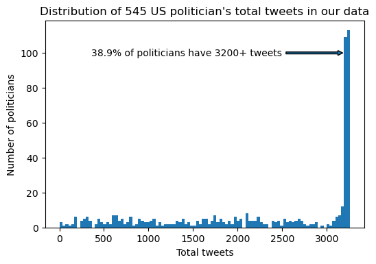
    


What's going on here?

The dataset description gives us a clue:

> The tweets are complete up to the oldest date for each user. (In other words, the API allows **going 3,200 back for any particular user**, so the tweets will be complete from present (today) back to oldest date available. If a politician posts frequently (like Trump), it may only go back a year.)

Depending on our particular research question, that restriction may be something we can ignore or it may necessitate changing our data-collection method.

## Machine learning basics: Vectorizing tweets and Training a model

In this tutorial, we'll be predicting the number of likes received by a tweet.  We call the variable we're trying to predict ("# likes") the _outcome_ or _target_.

To train and evaluate a linear regression model for this task, we need to do a few things:
 - Create a **training set**: which tweets will we use to train the model?  To decrease computational costs, we'll only use 100,000 (of 1.2 million total) tweets for training.  
 - Create a **test set**: we want a linear regression model that is capable of _generalizing_ to tweets not seen in the training set. To evaluate generalization performance, we'll identify a test set of tweets that aren't in the training set. We'll use the model to predict number of likes on the test set so that we can compare the actual number of likes to our predicted number.
 - **Vectorize** the tweets: machine learning models generally expect individual training data points to be represented a fixed-length, multi-dimensional _vectors_.  We typically call each of the dimensions of these vectors a _feature_, _predictor_, or _variable_.  We'll start by vectorizing our tweets into one-dimensional vector representations, then add additional dimensions to incoporate information from the tweets' text content.
 
We'll use [`pandas.DataFrame.sample`](https://pandas.pydata.org/pandas-docs/stable/reference/api/pandas.DataFrame.sample.html) to select a random 200,000 tweets to fill our train and test set.


```python
n_train = 100000
n_test = 100000
sampled_tweets = tweet_df.sample(n=n_train + n_test, random_state=0)
len(sampled_tweets)
```


    200000


Our outcome is just the number of likes (or `favorite_count` in our dataframe).  We use a `numpy` array to store our outcome.  Even though number of likes is an integer, we'll use 32-bit floating point numbers to store our outcome because the optimization libraries we'll use to train our models expect floating-point values.  


```python
y = np.array(sampled_tweets.favorite_count, dtype='float32')
y.shape
```


    (200000,)


We'll now create our vectors, stacking them in rows to create a single [_design matrix_](https://en.wikipedia.org/wiki/Design_matrix).  In this case, we can see (by inspecting the "shape"/dimensions) that the resulting matrix X has 200,000 rows (for the 100,000 training tweets and the 100,000 testing tweets) and 1 column: the number of retweets.

Using this vector representation of our tweets means training a model to ask: given a certain number of retweets for a tweet, how many likes did that tweet receive?


```python
X = np.array(sampled_tweets.retweet_count, dtype='float32').reshape((-1, 1))
X.shape
```


    (200000, 1)


Let's look at the data matrices we've constructed.


```python
plt.figure()
xs = X.reshape(-1)
ys = y
plt.hexbin(xs + 1, ys + 1, bins='log', xscale='log', yscale='log', mincnt=1)
plt.xlabel("X (# retweets)")
plt.ylabel("y (# likes)")

i = np.argmax(ys)
plt.annotate(f'{int(xs[i]):,} retweets\n{int(ys[i]):,} likes', (xs[i], ys[i]), xytext=(xs[i] * 10, 500), arrowprops={'arrowstyle': 'simple'}, va='center', ha='center')
print("Highest # of likes:")
print(sampled_tweets.iloc[i].text)

i = np.argmax(xs)
plt.annotate(f'{int(xs[i]):,} retweets\n{int(ys[i]):,} likes', (xs[i], 1), xytext=(xs[i], 5), arrowprops={'arrowstyle': 'simple'}, va='center', ha='right')
print("Highest # of retweets:")
print(sampled_tweets.iloc[i].text)

plt.show()
```

    Highest # of likes:
    Peaceful protests are a hallmark of our democracy. Even if I don't always agree, I recognize the rights of people to express their views.
    Highest # of retweets:
    RT @carterjwm: HELP ME PLEASE. A MAN NEEDS HIS NUGGS https://t.co/4SrfHmEMo3


    
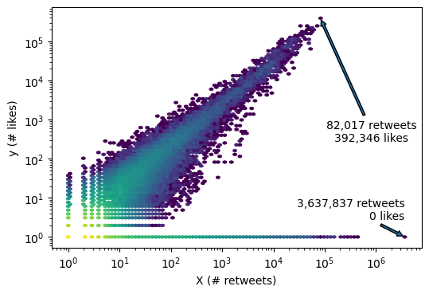
    


From the figure above, we can notice a few things about our data:
 - Looking at the bottom row, there are tweets with many retweets but zero likes, which is surprising. The extreme outlier in the figure above is [this tweet](https://twitter.com/carterjwm/status/849813577770778624), retweeted by a politician in our dataset. If we look at the tweet on twitter, we can see two peculiarities: this tweet has nearly 1 million likes (not 0 as our data suggests) and this tweet has 3.2 million retweets (not 3.6 million as our data suggests).  In a normal analysis, we would need to dig deeper: is this a problem with our understanding of the data or the API call?  Did the number of retweets decrease since June 2017 organically (due to human users deleting their retweets) or inorganically (due to e.g. Twitter's spam account cleanup operations)?  Note that visualizing the data is what allowed us to find this data hiccup. Always look at your data! For this analysis, we'll move forward with the dataset as-is, accepting that our results will be biased due to this issue.
 
Sidebar: What is causing this issue?  The answer can be found by noticing that the data has text "RT @carterjwm: HELP ME PLEASE. A MAN NEEDS HIS NUGGS", where "RT" means "retweet".  Does that mean that `favorite_count` doesn't include favorites on retweets?  We can use `pandas.crosstab` to compare tweets that contain the 'rt' token (lowercase due to our tokenization function) to tweets with more than 0 likes.  


```python
is_rt = tweet_df.text.map(lambda text: text.startswith('RT')).rename("is_retweet?")
pd.crosstab(is_rt, (tweet_df.favorite_count > 0).rename(">0 likes?"))
```


<div>
<style scoped>
    .dataframe tbody tr th:only-of-type {
        vertical-align: middle;
    }

    .dataframe tbody tr th {
        vertical-align: top;
    }

    .dataframe thead th {
        text-align: right;
    }
</style>
<table border="1" class="dataframe">
  <thead>
    <tr style="text-align: right;">
      <th>&gt;0 likes?</th>
      <th>False</th>
      <th>True</th>
    </tr>
    <tr>
      <th>is_retweet?</th>
      <th></th>
      <th></th>
    </tr>
  </thead>
  <tbody>
    <tr>
      <th>False</th>
      <td>224654</td>
      <td>762208</td>
    </tr>
    <tr>
      <th>True</th>
      <td>252181</td>
      <td>4327</td>
    </tr>
  </tbody>
</table>
</div>


We can see from the [contingency table](https://en.wikipedia.org/wiki/Contingency_table) that not every retweet has zero likes: 4327 retweets have 1 or more likes.  I believe this is due to ["quote tweets"](https://help.twitter.com/en/using-twitter/how-to-retweet), and investigating these quote tweets and deciding how to handle them in the analysis would be a great extension of this tutorial. (We're going to ignore them) Now, back to our observations about the figure above.

 - Number of retweets and number of likes seem to be positively correlated, as we might expect. If there was no correlation at all, then we would have no hope of modeling the relationship between the two.
 - Both number of retweets and number of likes span many orders of magnitude.

In [_Applied Linear Regression_](http://users.stat.umn.edu/~sandy/alr4ed/) (4th ed.) by Sanford Weisberg helpfully includes the **log rule**:

>If the values of a variable range over more than one order of magnitude and the variable is strictly positive, then replacing the variable by its logarithm is likely to be helpful.

Similarly Andrew Gelman exhorts us to ["log transform your positive data"](https://statmodeling.stat.columbia.edu/2019/08/21/you-should-usually-log-transform-your-positive-data/). As our data includes zero counts, we'll use the $\log(x+1)$ transformation instead. (For more graceful alternatives to adding 1, see some discussion [here](https://marcfbellemare.com/wordpress/12856).)

We'll transform both our predictor variable (number of retweets) and our outcome variable (number of likes).


```python
# our data spans multiple orders of magnitude: we'll apply a log transformation
X = np.log(X + 1)
y = np.log(y + 1)
```

We already sampled the data randomly, so to separate our our vectorized tweets and numeric outcome variables, we just need to take the first 100,000 rows as the training set and the next 100,000 rows as the test set.


```python
X_train = X[:n_train]
X_test = X[n_train:]
X_train.shape, X_test.shape
```


    ((100000, 1), (100000, 1))


```python
y_train = y[:n_train]
y_test = y[n_train:]
y_train.shape, y_test.shape
```


    ((100000,), (100000,))


To train a linear regression model, we'll use the scikit-learn package (referred to in code as `sklearn`).  We'll generally gloss over the usage details in this tutorial, but the [scikit-learn documentation](https://scikit-learn.org/stable/modules/linear_model.html) is useful and high-quality.


```python
def train_model(X_train, y_train):
    import sklearn.linear_model
    model = sklearn.linear_model.LinearRegression()
    model.fit(X_train, y_train)
    return model
```


```python
model = train_model(X_train, y_train)
```

In two dimensions (with one outcome and one predictor), linear regression is equivalent to a "line of best fit": the trained model object returned by scikit-learn includes the intercept and slope for that line.


```python
intercept = model.intercept_
slope = model.coef_[0]
intercept, slope
```


    (0.36170352, 0.5771629)


Using that intercept and slope, we can plot that line.  Each point along the line represents the model's prediction (y) given a particular number of retweets (x).  


```python
xs = X_test.reshape(-1)
ys = y_test
plt.hexbin(xs, ys, bins='log', mincnt=1)
plt.xlabel("X (log # retweets)")
plt.ylabel("y (log # likes)")

xs.sort()
fit_ys = intercept + slope * xs
plt.plot(xs, fit_ys, '--', linewidth=3, color='black', alpha=0.9)

plt.show()
```


    
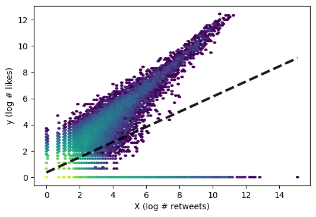
    


Maybe not what we expected?  Linear regression fits a model to minimize the distance between the predicted value and the actual value, averaged over all of the training data points.  The tweets without any likes count just as much as the tweets in the main cluster, so on average the best fit is achieved by dragging down the slope.

The average distance between the predicted value and the actual value is also how we (typically) evaluate a linear regression model.  To punish bigger mistakes more than small mistakes, we'll square the difference between the predicted and actual value before taking the mean.  We implement this metrix, [Mean Squared Error](https://en.wikipedia.org/wiki/Mean_squared_error), in the function below.  

Note that we pass in the testing set to `evaluate_model`, using the model object to make predictions before computing Mean Squared Error.


```python
def evaluate_model(model, X_test, y_test):
    y_pred = model.predict(X_test)
    # to compute Mean Squared Error, we first compute the absolute difference between
    # the true value and the predicted value
    absolute_errors = np.abs(y_test - y_pred)
    # then, we square the absolute differences and take the mean
    mean_squared_error = np.mean(absolute_errors ** 2)
    return mean_squared_error, absolute_errors, y_pred

mean_squared_error, absolute_errors, y_pred = evaluate_model(model, X_test, y_test)
mean_squared_error
```


    3.7528915


Mean Squared Error is hard to interpret; is 3.75 good?  We can develop our intuitions about the quality of the model by plotting the actual values vs the predicted values. An "oracle" model would predict the same as the actual value 100% of the time, which would result in a diagonal line. By looking at the plot below, we can see that we underpredict the true number of likes more than we overpredict the true number.

Further, if we round the prediction to the nearest integer, what percentage of the time is the model's prediction correct?  As we can see in the figure below, our first model is correct about 10% of the time. We also compute the percentage of tweets in the test set that are within 5 likes, which we can interpet as "mostly correct".

As we incorporate text content into our model, we'll aim to decrease Mean Squared Errors and increase the percentage of exactly correct predictions.


```python
y_pred_actual = np.exp(y_pred) - 1
y_test_actual = np.exp(y_test) - 1

plt.scatter(y_test_actual, y_pred_actual, color='black', marker='.', alpha=0.2)
plt.xlabel("Actual # likes")
plt.ylabel("Predicted # likes")

absolute_errors = np.abs(y_test_actual - y_pred_actual)
correct_inds = absolute_errors <= 5.5
plt.scatter(y_test_actual[correct_inds], y_pred_actual[correct_inds], color=matplotlib.cm.viridis(0.1), marker='.', label=f'Within 5 likes: {np.sum(correct_inds) / len(correct_inds):.1%}')

correct_inds = absolute_errors <= 0.5
plt.scatter(y_test_actual[correct_inds], y_pred_actual[correct_inds], color=matplotlib.cm.viridis(0.7), marker='.', label=f'Exactly correct: {np.sum(correct_inds) / len(correct_inds):.1%}')

plt.legend()

# due to weird axes, we need to tell matplotlib to rescale axes into log
ax = plt.gca()
ax.set_yscale('log')
ax.set_xscale('log')
plt.xlim(1, np.max(y_test_actual))
plt.ylim(1, np.max(y_pred_actual))

plt.show()
```


    
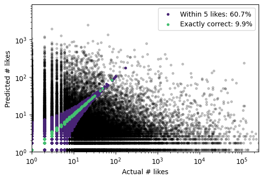
    


## Tokenizing texts

If we want to train a linear regression model that includes information from the tweet _text_, we have to turn the texts into vectors.

To turn texts into vectors, we first split our text into smaller units. Tokenization is the process of splitting a text into _tokens_, which can include words, punctuation, emoji, etc.  The most straight-forward tokenization approach for English text is to split on whitespace, which we implement in the next cell.  I generally refer to "words" and "tokens" interchangeably, which is bad linguistic practice but fine most of the time.

(For a good summary of modern tokenizers, see [here](https://huggingface.co/transformers/tokenizer_summary.html).)


```python
def simple_tokenize(tweet_text):
    tokens = tweet_text.split()
    return tokens
    
tweet_df['tokens'] = tweet_df.text.map(simple_tokenize)
```

Let's see if there are there are any problems with this approach.

We can count the number of tokens produced for each tweet. Here, we'll look at the tweet with the largest number of tokens.


```python
tweet_df['token_count'] = tweet_df.tokens.map(len)
tweet_df.token_count.max()
```


    42


```python
print(tweet_df[tweet_df.token_count == tweet_df.token_count.max()].text.iloc[0])
print(tweet_df[tweet_df.token_count == tweet_df.token_count.max()].tokens.iloc[0])
```

    .@SciCmteDems @MichaelEMann @RepBonamici @capitalweather @HouseScience @BadAstronomer @NaomiOreskes @ClimateFdbk @VariabilityBlog @RasmusBenestad @TimOsbornClim @AGW_Prof @CubaRaglanGuy @DeformedEarth @epispheric @mzelinka @hausfath @ChrisJMerchant @LovejoyShaun @PeterGleick And I want to invite anyone who wants to help defend science to fact-check future @HouseScience hearings at the hashtag #FactCheckSST 13/13
    ['.@SciCmteDems', '@MichaelEMann', '@RepBonamici', '@capitalweather', '@HouseScience', '@BadAstronomer', '@NaomiOreskes', '@ClimateFdbk', '@VariabilityBlog', '@RasmusBenestad', '@TimOsbornClim', '@AGW_Prof', '@CubaRaglanGuy', '@DeformedEarth', '@epispheric', '@mzelinka', '@hausfath', '@ChrisJMerchant', '@LovejoyShaun', '@PeterGleick', 'And', 'I', 'want', 'to', 'invite', 'anyone', 'who', 'wants', 'to', 'help', 'defend', 'science', 'to', 'fact-check', 'future', '@HouseScience', 'hearings', 'at', 'the', 'hashtag', '#FactCheckSST', '13/13']


Maybe we should reconsider our tokenization strategy.  

Right now, we treat 'country.'/'country', '#Thanksgiving'/'Thanksgiving', or 'Great'/'great' as different tokens. This is an important modeling decision!

We'll lowercase everything, remove punctuation, and convert all "at"s and links into the same token.  In practice, we would likely want to combine some custom rules with an existing rule-based tokenizer like [SpaCy](https://spacy.io/usage/spacy-101#annotations-token).


```python
import re

def normalize_token(token):
    # Lowercase and remove all non-alphanumeric characters
    return re.sub("[^0-9a-zA-Z]+", "", token).lower()

def better_tokenize(tweet_text):
    tokens = tweet_text.split()
    tokens_to_keep = []
    for token in tokens:
        if token.startswith('@'):  # replace all @s with a single token
            token = '@'
        elif token.startswith('https://'):  # replace all links with a single token
            token = '/link'
        else:
            token = normalize_token(token)
            if token == '':
                continue
        tokens_to_keep.append(token)
    return tokens_to_keep
    
tweet_df['tokens'] = tweet_df.text.map(better_tokenize)
tweet_df['token_count'] = tweet_df.tokens.map(len)
tweet_df.token_count.max()
```


    42


Here's a sampling of the longest tweets with the new tokenization strategy. Can you identify other ways we could improve our tokenization function?


```python
# here are the longest tweets with the
for row in tweet_df.sort_values(by='token_count', ascending=False).head(5).itertuples():
    print(f"{row.screen_name} ({row.token_count} tokens):\n{row.text}\n{row.tokens}\n")
```

    RepDonBeyer (42 tokens):
    .@SciCmteDems @MichaelEMann @RepBonamici @capitalweather @HouseScience @BadAstronomer @NaomiOreskes @ClimateFdbk @VariabilityBlog @RasmusBenestad @TimOsbornClim @AGW_Prof @CubaRaglanGuy @DeformedEarth @epispheric @mzelinka @hausfath @ChrisJMerchant @LovejoyShaun @PeterGleick And I want to invite anyone who wants to help defend science to fact-check future @HouseScience hearings at the hashtag #FactCheckSST 13/13
    ['scicmtedems', '@', '@', '@', '@', '@', '@', '@', '@', '@', '@', '@', '@', '@', '@', '@', '@', '@', '@', '@', 'and', 'i', 'want', 'to', 'invite', 'anyone', 'who', 'wants', 'to', 'help', 'defend', 'science', 'to', 'factcheck', 'future', '@', 'hearings', 'at', 'the', 'hashtag', 'factchecksst', '1313']
    
    GovernorTomWolf (38 tokens):
    .@RepLouBarletta @CongBoyle @RepBrady @RepCartwright @RepRyanCostello @RepCharlieDent @USRepMikeDoyle @RepDwightEvans @RepFitzpatrick @MikeKellyPA @RepTomMarino @RepMeehan @RepTimMurphy @RepScottPerry @KeithRothfus @RepBillShuster @RepSmucker @CongressmanGT #VoteNoAHCA: No CBO score, no public hearings, no text of final bill for public. Too important to rush. https://t.co/TPBpwNhUal #SaveACAinPA
    ['reploubarletta', '@', '@', '@', '@', '@', '@', '@', '@', '@', '@', '@', '@', '@', '@', '@', '@', '@', 'votenoahca', 'no', 'cbo', 'score', 'no', 'public', 'hearings', 'no', 'text', 'of', 'final', 'bill', 'for', 'public', 'too', 'important', 'to', 'rush', '/link', 'saveacainpa']
    
    GovernorTomWolf (36 tokens):
    .@RepLouBarletta @CongBoyle @RepBrady @RepCartwright @RepRyanCostello @RepCharlieDent @USRepMikeDoyle @RepDwightEvans @RepFitzpatrick @MikeKellyPA @RepTomMarino @RepMeehan @RepTimMurphy @RepScottPerry @KeithRothfus @RepBillShuster @RepSmucker @CongressmanGT #VoteNoAHCA: GOP lawmakers exempt their own insurance from the changes to the AHCA–but not for PA'ians. https://t.co/Oe2VL3SWOp #SaveACAinPA
    ['reploubarletta', '@', '@', '@', '@', '@', '@', '@', '@', '@', '@', '@', '@', '@', '@', '@', '@', '@', 'votenoahca', 'gop', 'lawmakers', 'exempt', 'their', 'own', 'insurance', 'from', 'the', 'changes', 'to', 'the', 'ahcabut', 'not', 'for', 'paians', '/link', 'saveacainpa']
    
    GovernorTomWolf (36 tokens):
    .@RepLouBarletta @CongBoyle @RepBrady @RepCartwright @RepRyanCostello @RepCharlieDent @USRepMikeDoyle @RepDwightEvans @RepFitzpatrick @MikeKellyPA @RepTomMarino @RepMeehan @RepTimMurphy @RepScottPerry @KeithRothfus @RepBillShuster @RepSmucker @CongressmanGT #VoteNoAHCA: A House Republican actually said "I don't think any individual has read the whole bill." https://t.co/D8ocKpAYFD #SaveACAinPA
    ['reploubarletta', '@', '@', '@', '@', '@', '@', '@', '@', '@', '@', '@', '@', '@', '@', '@', '@', '@', 'votenoahca', 'a', 'house', 'republican', 'actually', 'said', 'i', 'dont', 'think', 'any', 'individual', 'has', 'read', 'the', 'whole', 'bill', '/link', 'saveacainpa']
    
    RepDonBeyer (36 tokens):
    .@ponumurray @ChrisMurphyCT @SenBlumenthal @GerryConnolly @ChrisVanHollen @rosadelauro @RepEsty @Dan_at_Brady @Bradybuzz @NewtownAction In this picture, my friends Andy &amp; Barbara Parker, whose daughter Alison, a tv reporter, was killed by someone who should not have had a gun
    ['ponumurray', '@', '@', '@', '@', '@', '@', '@', '@', '@', 'in', 'this', 'picture', 'my', 'friends', 'andy', 'amp', 'barbara', 'parker', 'whose', 'daughter', 'alison', 'a', 'tv', 'reporter', 'was', 'killed', 'by', 'someone', 'who', 'should', 'not', 'have', 'had', 'a', 'gun']
    


```python
plt.hist(tweet_df.token_count, bins=range(0, tweet_df.token_count.max() + 1))
plt.title("Distribution of tokens per tweet")
plt.xlabel("Number of tokens")
plt.ylabel("Number of tweets")
mean_token_count = tweet_df.token_count.mean()
plt.axvline(mean_token_count, color='black', label=f'Mean tokens = {mean_token_count:.1f}')
plt.legend()
plt.show()
```


    
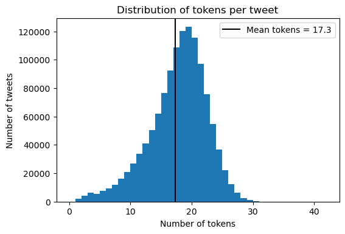
    


Now that we've tokenized our tweets, we can compute the number of times each word occurs across all of our tweets.  We'll need these counts later, and for now it gives a useful sense of our dataset to look at the most commonly-occurring tokens.

To count the words, we can use the Python built-in `collections.Counter`.


```python
from collections import Counter

token_counter = Counter()
for tokens in tweet_df.tokens:
    token_counter.update(tokens)
token_counter.most_common(10)
```


    [('@', 989015),
     ('to', 779941),
     ('the', 735312),
     ('/link', 499420),
     ('of', 367153),
     ('in', 364656),
     ('for', 338542),
     ('a', 279474),
     ('rt', 267394),
     ('on', 266927)]


## Creating vectors from tokens

Our first vectorization approach is straightforward:

 - Choose a set of words (called a "vocabulary").
 - Create a feature for each word in the vocabulary: 0 if the word is present in the text, 1 otherwise.
 - The vector representation of a text is its values for each of the features.
 
For example, if my vocabulary is ["apple", "orange"], then I will produce two-dimensional vectors.  Here are a few examples of texts, their token sequences, and the resulting vector representation.

 - "No fruit here." ⟶ ["no", "fruit", "here"] ⟶ [0, 0]
 - "I bought an apple." ⟶ ["i", "bought", "an", "apple"] ⟶ [1, 0]
 - "Orange juice for me, please!" ⟶ ["orange", "juice", "for", "me", "please"] ⟶ [0, 1]
 - "Apple or orange?" ⟶ ["apple", "or", "orange"] ⟶ [1, 1]
 
We'll create our outcome in the same way we did above.


```python
n_train = 100000
n_test = 100000
sampled_tweets = tweet_df.sample(n=n_train + n_test, random_state=0)

y = np.array(sampled_tweets.favorite_count, dtype='float32')
y = np.log(y + 1)
y.shape
```


    (200000,)


For this example, we'll use a 5-word vocabulary.  As we vectorize, we'll build our design matrix at the same time.

The resulting matrix has five columns, corresponding in order to each of the five words.


```python
vocabulary = ['/link', 'thanks', 'happy', 'angry', 'the']
V = len(vocabulary)
X = np.zeros((len(sampled_tweets), V), dtype='float32')

for i, tokens in enumerate(sampled_tweets.tokens):
    for j, vocab_token in enumerate(vocabulary):
        if vocab_token in tokens:
            X[i, j] = 1
X.shape
```


    (200000, 5)


Now we're ready to retrain our model with the new vector representation.


```python
# same as above
X_train = X[:n_train]
X_test = X[n_train:]
y_train = y[:n_train]
y_test = y[n_train:]
```


```python
model = train_model(X_train, y_train)
```


```python
# what's the performance like for our new model?
mean_squared_error, absolute_errors, y_pred = evaluate_model(model, X_test, y_test)
mean_squared_error
```


    2.6667957


### Comparing models

2.67 Mean Squared Error is lower than the 3.75 Mean Squared Error we achieved above, so this content-based model is "better".

Looking at the figure below, we can see that this model predicts far fewer likes on average; when we're wrong, we tend to way _underestimate_ the true number of likes.

Note also that are ability to predict exactly correctly has fallen, from 10% to 6%! That's one sign that Mean Squared Error may be an inappropriate metric for our problem.


```python
# same visualization as above
y_pred_actual = np.exp(y_pred) - 1
y_test_actual = np.exp(y_test) - 1

plt.scatter(y_test_actual, y_pred_actual, color='black', marker='.', alpha=0.2)
plt.xlabel("Actual # likes")
plt.ylabel("Predicted # likes")

absolute_errors = np.abs(y_test_actual - y_pred_actual)
correct_inds = absolute_errors <= 5.5
plt.scatter(y_test_actual[correct_inds], y_pred_actual[correct_inds], color=matplotlib.cm.viridis(0.1), marker='.', label=f'Within 5 likes: {np.sum(correct_inds) / len(correct_inds):.1%}')

correct_inds = absolute_errors <= 0.5
plt.scatter(y_test_actual[correct_inds], y_pred_actual[correct_inds], color=matplotlib.cm.viridis(0.7), marker='.', label=f'Exactly correct: {np.sum(correct_inds) / len(correct_inds):.1%}')

plt.legend()

# use log scales for the axes
ax = plt.gca()
ax.set_yscale('log')
ax.set_xscale('log')

plt.show()
```


    
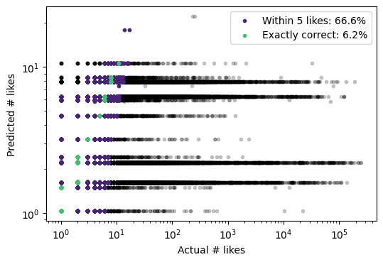
    


### Inspecting the model's weights

Let's create a histogram of model weights.


```python
plt.bar(range(V), model.coef_)
plt.axhline(0, color='gray')
plt.xticks(range(V), vocabulary)

plt.show()
```


    
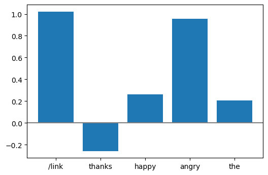
    


We can use these weights as a rough estimate of importance: the presence of links or the word 'angry' are associated with the greatest increase in number of likes. Surprisingly, the presence of the word 'thanks' is associated with a decrease in number of likes. However, interpreting these weights directly is risky: we are likely to have [multicolinearity](https://en.wikipedia.org/wiki/Multicollinearity) problems. (These problems will get worse the larger our vocabulary is.)

## Turning tokens into bag-of-words

We don't want to manually choose words for our vocabulary.
 - It's slow and requires lots of domain knowledge.
 - Humans have very bad intuitions about what words are important.
 - Even if we generate a big word list (1000+), we are ignoring most of the content in the tweets!
 
By knowing a little bit about language data, we can choose words in a more general way.

### Zipf's Law

Word (or token) usage follows a predictable distribution.

If 'to' is the most common word in our data and appears at frequency $f_{\text{max}}$, then the frequency of the second most common word is approximately $f = \frac{1}{2} f_{\text{max}}$, the frequency of the third most common word is approximately $f = \frac{1}{3} f_{\text{max}}$, etc.

In general terms, the $k$th most common word appears with frequency $f = \frac{1}{k} f_{\text{max}}$.

We can see that our data follow this trend fairly well by plotting the sorted word frequencies (from the `token_counter` we created above).


```python
# plot word rank vs word count
token_counts = np.array([count for token, count in token_counter.most_common()])
plt.loglog(range(1, len(token_counts)+1), token_counts)

# compute and plot the counts if the true distribution was Zipfian
largest_count = token_counts[0]
true_zipf = [(1, largest_count)]
for i in np.geomspace(1, len(token_counts), endpoint=True, num=25):
    rank = int(i) + 1
    true_zipf.append((rank, largest_count * 1/rank))
xs, ys = zip(*true_zipf)
plt.plot(xs, ys, color='gray', linestyle='-', alpha=0.5)
plt.xlabel("Frequency rank of token")
plt.ylabel("Absolute frequency of token")
plt.title(f"Zipf plot for {len(token_counts):,} unique tokens")
# annotate the hapax legomena 
plt.annotate(f"{sum(token_counts == 1) / len(token_counts):.1%} of tokens appear exactly once",
             xy=(len(token_counts) * 0.2, 1), xytext=(10**4.5, 1), arrowprops={'arrowstyle': 'simple'}, va='center', ha='right')
plt.show()
```


    
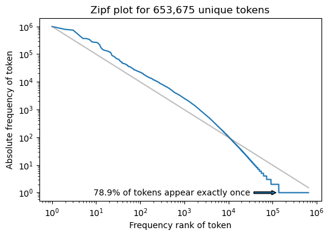
    


We call tokens that appear exactly once [_hapax legomena_](https://en.wikipedia.org/wiki/Hapax_legomenon) or sometimes just _hapaxes_.

80% is higher than we would expect for more general English text. 

One implication of word frequency being "Zipfian" is that we can't learn much from _most_ tokens (as they appear only once!).  In practice, we'll choose a vocabulary that includes the $n$ most-frequent words. 

How many words should we include in our vocabulary?  We can either set a particular $n$ or choose based on the minimum word frequency. For example let's look at how vocabulary size changes as we raise the minimum word frequency requirement:


```python
# how large will our vocabulary be at different absolute token frequency cut-offs?
xs = []
ys =[]
for i in range(2, 10):
    xs.append(i)
    ys.append(np.sum(token_counts >= i))
    
plt.plot(xs, ys)
plt.scatter(xs, ys, color='black', zorder=5)
plt.xlabel("Minimum count for tokens in our vocabulary")
plt.ylabel("Total vocabulary size (|V|)")

plt.show()
```


    
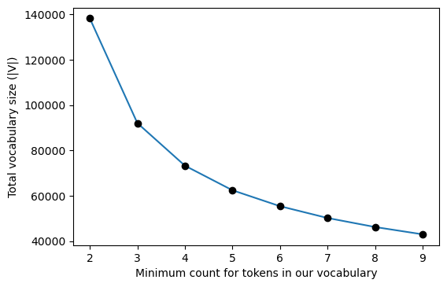
    


Note: vocabulary size is an empirical question, and should be chosen based on desired purpose. If the goal is to maximize predictive model performance, than vocab size should be treated as a hyperparameter during model selection.

We'll set our vocab size to 30,000, which is a reasonable and fairly common value.


```python
V = 30000
token_index_map = {}
index = 0
for token, count in token_counter.most_common(V):
    token_index_map[token] = index
    index += 1
```

The `token_index_map` we just created captures the vocabulary, as it maps from tokens to particular indices in our feature vectors.  If a word isn't in the `token_index_map`, it will be ignored.


```python
# to check our work, we need to map back from indices to the actual token text
index_token_map = {index: token for token, index in token_index_map.items()}
```


```python
token_index_map['iraq']
```


    1437


```python
index_token_map[1437]
```


    'iraq'


```python
# the very last word in our vocabulary
index_token_map[29999]
```


    'demos'


### Vectorizing texts using our vocabulary
We'll build the tweet vectors (and design matrix) largely as we did when |V| was 5, just at a larger scale and using the `token_index_map`. One additional improvement we'll make is to track not just whether a word is present (feature = 1) or not (feature = 0), but the number of times the word occurs in the tweet.

Because each row is a tweet and each column is a token, we call the resulting matrix a [document-term matrix](https://en.wikipedia.org/wiki/Document-term_matrix). In our case, "tweet" and "document" mean the same thing. "Term" just means "token".

We call this approach "bag of words" because the vectorized tweet no longer contains information about word order. "Apple or orange?" and "Orange or apple?" will both have the same vector representation, since they contain the same raw token counts and differ only in order.


```python
n_train = 100000
n_test = 100000
sampled_tweets = tweet_df.sample(n=n_train + n_test, random_state=0)

y = np.array(sampled_tweets.favorite_count, dtype='float32')
y = np.log(y + 1)
y.shape
```


    (200000,)


```python
X = np.zeros((len(sampled_tweets), V), dtype='float32')
for row_ind, tokens in enumerate(sampled_tweets.tokens):
    for token in tokens:
        if token not in token_index_map:
            # this is a word not in the vocabulary!
            continue
        column_ind = token_index_map[token]
        X[row_ind, column_ind] += 1
X.shape
```


    (200000, 30000)


We'll look at a random tweet in the training data to see what features will be assigned non-zero values.


```python
row_ind = 0
print(sampled_tweets.iloc[row_ind].text + "\n")

# this next line is a bit of numpy magic, but it returns the indices that are non-zero in X[row_ind,:]
for column_ind in np.argwhere(X[row_ind,:]).ravel():
    if column_ind == V:
        print(f"ind= {column_ind:>5}  n= {X[row_ind,column_ind]:.0f}  intercept")
    else:
        token = index_token_map[column_ind]
        print(f"ind= {column_ind:>5}  n= {X[row_ind,column_ind]:.0f}  token= {token}")

```

    ICYMI I called on my colleagues in Congress to reform how we calculate Social Security COLAs https://t.co/JOPaHggJe2
    
    ind=     1  n= 1  token= to
    ind=     3  n= 1  token= /link
    ind=     5  n= 1  token= in
    ind=     9  n= 1  token= on
    ind=    16  n= 1  token= i
    ind=    17  n= 1  token= my
    ind=    19  n= 1  token= we
    ind=    61  n= 1  token= congress
    ind=    79  n= 1  token= how
    ind=   172  n= 1  token= security
    ind=   174  n= 1  token= icymi
    ind=   189  n= 1  token= reform
    ind=   333  n= 1  token= colleagues
    ind=   721  n= 1  token= social
    ind=   921  n= 1  token= called
    ind= 25594  n= 1  token= calculate
    ind= 26036  n= 1  token= colas


### Sidebar: using sparse matrices to save memory

As we can see from the code below, the dense matrix we've instantiated uses almost 22GB of RAM. Further, 99.9% of the cells in the matrix are zero, which is a huge waste of memory.


```python
X.nbytes / 1024 / 1024 / 1024  # 22 GB!!!
```


    22.351741790771484


```python
# 99.9% of cells in our matrix are zero!! huge waste of memory
np.sum(X == 0) / (X.shape[0] * X.shape[1])
```


    0.999485602


In practice, we'll use a _sparse matrix_ format to only store the cells that contain non-zero values.

We can use the [`scipy.sparse`](https://docs.scipy.org/doc/scipy/reference/sparse.html) package for this.  In our case, we can convert directly from the dense format to the sparse matrix format, but we can save memory by constructing the matrix directly in the sparse format.


```python
import scipy.sparse
X = scipy.sparse.coo_matrix(X)
```


```python
# NNZ = "Number of Non-Zero" values stored in the matrix
n_stored_bytes = (X.nnz * 4)
n_stored_bytes / 1024 / 1024 / 1024  # 0.01 GB!
```


    0.01149769127368927


```python
X = X.tocsr()
```

### Training a model using the document-term matrix

So how does our 30,000-word bag-of-words vectorization compare to our two previous models? Let's train a new model and find out.


```python
# same as above
X_train = X[:n_train]
X_test = X[n_train:]
y_train = y[:n_train]
y_test = y[n_train:]
X_train.shape, X_test.shape
```


    ((100000, 30000), (100000, 30000))


Previously, we've trained models using our convenience function: `model = train_model(X_train, y_train)`

Training this model will take a long time using a sparse feature matrix this large.  For numerical reasons, we can speed up optimization by using some form of [regularization](https://en.wikipedia.org/wiki/Tikhonov_regularization). We'll use the "Ridge" estimator, which will bias the weights learned by the model (to be closer to 0) and speed up estimation.  

Sidebar: Regularization actually improves the performance of the model: the added bias addresses the multicolinearity problems that arise with large numbers of features.  The `train_model` approach produces a model with 2.47 Mean Squared Error (not shown in this tutorial), which is higher than the value we get below. Using the 30000 most common words rather than 5 hand-picked words does result in a better Mean Squared Error, even accounting for the use of the Ridge estimator.


```python
import sklearn.linear_model
model = sklearn.linear_model.Ridge(alpha=10.0, solver='sparse_cg')
model.fit(X_train, y_train)
```


    Ridge(alpha=10.0, solver='sparse_cg')


```python
mean_squared_error, absolute_errors, y_pred = evaluate_model(model, X_test, y_test)
mean_squared_error
```


    1.7708157


1.77 is a lot lower than our previous error! We've increased the amount we're exactly correct as well.


```python
# same visualization as above
y_pred_actual = np.exp(y_pred) - 1
y_test_actual = np.exp(y_test) - 1

plt.scatter(y_test_actual, y_pred_actual, color='black', marker='.', alpha=0.2)
plt.xlabel("Actual # likes")
plt.ylabel("Predicted # likes")

absolute_errors = np.abs(y_test_actual - y_pred_actual)
correct_inds = absolute_errors <= 5.5
plt.scatter(y_test_actual[correct_inds], y_pred_actual[correct_inds], color=matplotlib.cm.viridis(0.1), marker='.', label=f'Within 5 likes: {np.sum(correct_inds) / len(correct_inds):.1%}')

correct_inds = absolute_errors <= 0.5
plt.scatter(y_test_actual[correct_inds], y_pred_actual[correct_inds], color=matplotlib.cm.viridis(0.7), marker='.', label=f'Exactly correct: {np.sum(correct_inds) / len(correct_inds):.1%}')

plt.legend()

# use log scales for the axes
ax = plt.gca()
ax.set_yscale('log')
ax.set_xscale('log')
plt.xlim(1, np.max(y_test_actual))
plt.ylim(1, np.quantile(y_pred_actual, 0.9999))

plt.show()
```


    
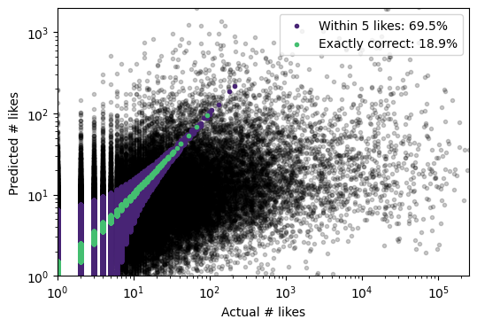
    


Let's look at the weights for the top-20 tokens by frequency.


```python
n = 20
w = model.coef_[:n]
plt.bar(range(n), w)
plt.axhline(0, color='gray')
plt.ylabel("Weight (Model coefficient)")
token_labels = [index_token_map[i] for i in range(n)]
plt.xticks(range(n), token_labels, rotation=45)

plt.show()
```


    
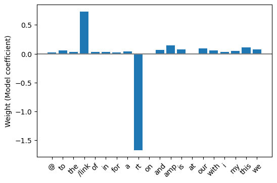
    


Weights are generally small, with the exception of retweets (which we've already talked about getting assigned zero likes in our data) and links (which tend to be associated with more likes).

But these are just 20 of our features, what if we want to reason about the other 29980 features?


```python
w = np.array(model.coef_)
w.sort()
plt.vlines(range(len(w)), np.minimum(w, 0), np.maximum(w, 0), linewidth=0.5)
plt.xlabel("Features (sorted by weight)")
plt.ylabel("Weight (Model coefficient)")
plt.annotate(f'Lowest weight ({w[0]:.2f})', xy=(0, w[0]), xytext=(5000, w[0]), arrowprops={'arrowstyle': 'simple'}, va='center', ha='left')
plt.annotate(f'Highest weight ({w[-1]:.2f})', xy=(30000, w[-1]), xytext=(25000, w[-1]), arrowprops={'arrowstyle': 'simple'}, va='center', ha='right')
plt.annotate(f'{np.sum(w == 0) / len(w):.2%} of the weights are zero', xy=(15000, 0), xytext=(15000, 1), arrowprops={'arrowstyle': 'simple'}, va='center', ha='center')
plt.show()
```


    
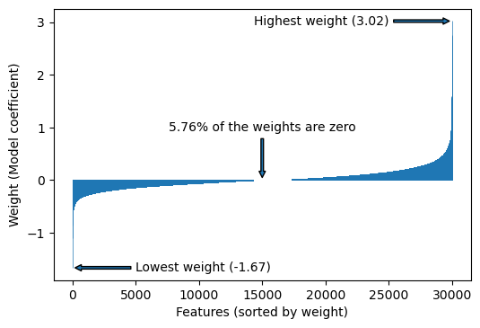
    


Sorting the weights allows us to see their relative magnitudes and the distribution, as well as revealing that nearly 6% of the weights are assigned a weight of zero.  

If we want to look at the weights on the extremes, it will be easier if we extract the token weights into a DataFrame.


```python
w = model.coef_
weights = []
for i, weight in enumerate(w):
    token = index_token_map[i]
    weights.append({
        'token': token,
        'token_count': token_counter[token],
        'weight': weight,
        'abs_weight': np.abs(weight),
    })
        
weight_df = pd.DataFrame(weights)
len(weight_df)
```


    30000


```python
weight_df.sample(n=5)
```


<div>
<style scoped>
    .dataframe tbody tr th:only-of-type {
        vertical-align: middle;
    }

    .dataframe tbody tr th {
        vertical-align: top;
    }

    .dataframe thead th {
        text-align: right;
    }
</style>
<table border="1" class="dataframe">
  <thead>
    <tr style="text-align: right;">
      <th></th>
      <th>token</th>
      <th>token_count</th>
      <th>weight</th>
      <th>abs_weight</th>
    </tr>
  </thead>
  <tbody>
    <tr>
      <th>28760</th>
      <td>underutilized</td>
      <td>17</td>
      <td>-0.042325</td>
      <td>0.042325</td>
    </tr>
    <tr>
      <th>28099</th>
      <td>230p</td>
      <td>18</td>
      <td>0.000000</td>
      <td>0.000000</td>
    </tr>
    <tr>
      <th>9431</th>
      <td>repdianeblack</td>
      <td>115</td>
      <td>-0.142293</td>
      <td>0.142293</td>
    </tr>
    <tr>
      <th>6886</th>
      <td>engines</td>
      <td>190</td>
      <td>0.012400</td>
      <td>0.012400</td>
    </tr>
    <tr>
      <th>11457</th>
      <td>espaillatny</td>
      <td>84</td>
      <td>-0.044266</td>
      <td>0.044266</td>
    </tr>
  </tbody>
</table>
</div>


Looking good! Now we can sort by weight to look at the largest and smallest features.


```python
weight_df = weight_df.sort_values(by='weight', ascending=False)
```


```python
weight_df.head(10)
```


<div>
<style scoped>
    .dataframe tbody tr th:only-of-type {
        vertical-align: middle;
    }

    .dataframe tbody tr th {
        vertical-align: top;
    }

    .dataframe thead th {
        text-align: right;
    }
</style>
<table border="1" class="dataframe">
  <thead>
    <tr style="text-align: right;">
      <th></th>
      <th>token</th>
      <th>token_count</th>
      <th>weight</th>
      <th>abs_weight</th>
    </tr>
  </thead>
  <tbody>
    <tr>
      <th>7964</th>
      <td>makeamericagreatagain</td>
      <td>151</td>
      <td>3.021243</td>
      <td>3.021243</td>
    </tr>
    <tr>
      <th>11472</th>
      <td>trump2016</td>
      <td>84</td>
      <td>2.750839</td>
      <td>2.750839</td>
    </tr>
    <tr>
      <th>5716</th>
      <td>crooked</td>
      <td>253</td>
      <td>2.745887</td>
      <td>2.745887</td>
    </tr>
    <tr>
      <th>7774</th>
      <td>americafirst</td>
      <td>157</td>
      <td>2.612355</td>
      <td>2.612355</td>
    </tr>
    <tr>
      <th>9204</th>
      <td>dishonest</td>
      <td>119</td>
      <td>2.159368</td>
      <td>2.159368</td>
    </tr>
    <tr>
      <th>12561</th>
      <td>industrialized</td>
      <td>72</td>
      <td>2.118224</td>
      <td>2.118224</td>
    </tr>
    <tr>
      <th>2189</th>
      <td>devos</td>
      <td>1009</td>
      <td>2.000655</td>
      <td>2.000655</td>
    </tr>
    <tr>
      <th>19142</th>
      <td>crookedhillary</td>
      <td>36</td>
      <td>1.916129</td>
      <td>1.916129</td>
    </tr>
    <tr>
      <th>6957</th>
      <td>flynns</td>
      <td>188</td>
      <td>1.734988</td>
      <td>1.734988</td>
    </tr>
    <tr>
      <th>13353</th>
      <td>bigleaguetruth</td>
      <td>65</td>
      <td>1.656239</td>
      <td>1.656239</td>
    </tr>
  </tbody>
</table>
</div>


Looks like a variety of Trump-related terminology is most associated with receiving likes.


```python
weight_df.tail(10)
```


<div>
<style scoped>
    .dataframe tbody tr th:only-of-type {
        vertical-align: middle;
    }

    .dataframe tbody tr th {
        vertical-align: top;
    }

    .dataframe thead th {
        text-align: right;
    }
</style>
<table border="1" class="dataframe">
  <thead>
    <tr style="text-align: right;">
      <th></th>
      <th>token</th>
      <th>token_count</th>
      <th>weight</th>
      <th>abs_weight</th>
    </tr>
  </thead>
  <tbody>
    <tr>
      <th>919</th>
      <td>ia03</td>
      <td>2742</td>
      <td>-0.714490</td>
      <td>0.714490</td>
    </tr>
    <tr>
      <th>5009</th>
      <td>hagel</td>
      <td>311</td>
      <td>-0.714975</td>
      <td>0.714975</td>
    </tr>
    <tr>
      <th>11305</th>
      <td>pittenger</td>
      <td>86</td>
      <td>-0.737141</td>
      <td>0.737141</td>
    </tr>
    <tr>
      <th>5798</th>
      <td>hassans</td>
      <td>248</td>
      <td>-0.769951</td>
      <td>0.769951</td>
    </tr>
    <tr>
      <th>1479</th>
      <td>sctweets</td>
      <td>1655</td>
      <td>-0.807138</td>
      <td>0.807138</td>
    </tr>
    <tr>
      <th>3922</th>
      <td>franken</td>
      <td>455</td>
      <td>-0.837031</td>
      <td>0.837031</td>
    </tr>
    <tr>
      <th>6299</th>
      <td>tedstrickland</td>
      <td>218</td>
      <td>-0.849467</td>
      <td>0.849467</td>
    </tr>
    <tr>
      <th>8531</th>
      <td>mow50</td>
      <td>135</td>
      <td>-0.861965</td>
      <td>0.861965</td>
    </tr>
    <tr>
      <th>2356</th>
      <td>brownback</td>
      <td>908</td>
      <td>-1.101062</td>
      <td>1.101062</td>
    </tr>
    <tr>
      <th>8</th>
      <td>rt</td>
      <td>267394</td>
      <td>-1.668904</td>
      <td>1.668904</td>
    </tr>
  </tbody>
</table>
</div>


Among the negative weights, things are a little less clear.

We've already discussed why retweets (which contain the token 'rt') will have zero likes, so the strong negative weight makes sense. But why such a strong negative weight for 'brownback'?  Let's look at the underlying data.


```python
tweet_df[tweet_df.tokens.map(lambda tokens: 'brownback' in tokens)].sample(n=5)[['screen_name', 'text', 'favorite_count']]
```


<div>
<style scoped>
    .dataframe tbody tr th:only-of-type {
        vertical-align: middle;
    }

    .dataframe tbody tr th {
        vertical-align: top;
    }

    .dataframe thead th {
        text-align: right;
    }
</style>
<table border="1" class="dataframe">
  <thead>
    <tr style="text-align: right;">
      <th></th>
      <th>screen_name</th>
      <th>text</th>
      <th>favorite_count</th>
    </tr>
  </thead>
  <tbody>
    <tr>
      <th>124361</th>
      <td>govsambrownback</td>
      <td>Watch the video of Gov. #Brownback on @Bloombe...</td>
      <td>2</td>
    </tr>
    <tr>
      <th>67571</th>
      <td>govsambrownback</td>
      <td>LtGov Colyer: Leg Oversight Essential to Provi...</td>
      <td>0</td>
    </tr>
    <tr>
      <th>19606</th>
      <td>govsambrownback</td>
      <td>Don't live in Wichita and want to watch tonigh...</td>
      <td>0</td>
    </tr>
    <tr>
      <th>91785</th>
      <td>govsambrownback</td>
      <td>Gov #Brownback Makes Appointment to the 10th J...</td>
      <td>0</td>
    </tr>
    <tr>
      <th>43611</th>
      <td>govsambrownback</td>
      <td>Gov Brownback met w/ employees of Triumph Stru...</td>
      <td>0</td>
    </tr>
  </tbody>
</table>
</div>


This looks like fairly normal stuff: tweets from Kansas Governor [Sam Brownback](https://en.wikipedia.org/wiki/Sam_Brownback) about day-to-day stuff, not attracting any engagement.  However, I noticed that the account was [suspended by Twitter](https://twitter.com/govsambrownback).  What's going on here?  Local Kansas newspaper the Topeka Capital-Journal has an [article about it](https://web.archive.org/web/20201121023459/https://www.cjonline.com/news/20181108/fake-sam-brownback-feed-on-twitter-stirs-up-kansans-post-election): the account was run by an imposter unaffiliated with Sam Brownback!  These tweets weren't really generated by a US politician, and our model helped us identify this account as an outlier that we would likely want to remove from our dataset.  

### Error analysis

One final task that can help us understand the model we've trained is to look at the errors.

First, let's look at the distribution of predicted vs actual scores in a different way than we have before.


```python
# we exponentiate the values to "undo" the log transform we applied
actual = np.exp(y_test) - 1
# and for the predicted values, we need to round
# we'll use Numpy's around() for this, although this will introduce some slight rounding error
predicted = np.around(np.exp(y_pred) - 1)
# there's a further issue: we are using a model that can produce negative predictions
print(f"{np.sum(predicted < 0) / len(predicted):.1%} of predictions are below zero pre-correction")
# we'll fix this by forcing all negative values to be 0 (which will increase our accuracy compared to our previous comparison)
predicted = np.maximum(predicted, 0)

errors = actual - predicted
print(f"{np.sum(errors == 0) / len(errors):.1%} predict the correct number of likes")
print(f"{np.sum(errors > 0) / len(errors):.1%} under-predict number of likes")
print(f"{np.sum(errors < 0) / len(errors):.1%} over-predict number of likes")
print(f"Mean prediction error: {np.mean(errors):.2f}")

# we use Numpy quantile() to only show up to the 99th percentile of true values
bins = np.linspace(0, np.quantile(actual, 0.99))
plt.hist(actual, bins=bins, alpha=0.5, log=True, label="True")
plt.hist(predicted, bins=bins, alpha=0.5, log=True, label="Predicted")
plt.legend()
plt.xlabel("# of likes")
plt.ylabel("Tweet count")
plt.show()
```

    3.0% of predictions are below zero pre-correction
    21.4% predict the correct number of likes
    32.0% under-predict number of likes
    46.6% over-predict number of likes
    Mean prediction error: 192.00


    
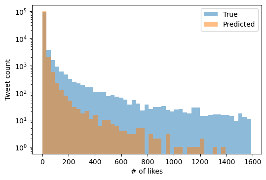
    


The summary statistics reveal that we over-predict (47% of tweets) more than we under-predict (32% of tweets).  However, looking at the visualization can help us understand these errors: even excluding the mega-viral tweets, we chronically under-predict on any tweet with more than 1000 likes since the model rarely produces scores that large.  It looks like the majority of over-prediction is occurring for tweets that have zero likes.  

## Next steps: Improving our vector representations

To further improve our model, we can improve the quality of our vector representations.  [**TF-IDF**](https://en.wikipedia.org/wiki/Tf-idf) is a re-weighting of the bag-of-words vectors we've constructed for each document that has strong empirical performance. The reweighting consists of two parts:

 - _Term frequency_ (TF): The term frequency is just the number of times the token appears in a document, which is what we are currently using.  We can improve our term frequency representation by taking the log of the raw count plus 1: this transformation serves to reduce the weight of a word occurring multiple times. Intuitively, a tweet that uses the same word twice should not receive twice the weight for that feature as a tweet that use that word once.
 - _Inverse Document Frequency_ (IDF): The document frequency is the proportion of documents in which the word appears. We multiply by the _inverse_ of the document frequency, which decreases the weight of tokens which occur a lot, like 'the'.  
 
[scikit-learn's documentation](https://scikit-learn.org/stable/modules/feature_extraction.html#tfidf-term-weighting) summarizes some of the math behind TF-IDF.
 
An additional limitation of the vectorization approach we've chosen is that we completely ignore words that aren't in our vocabulary.  One approach to address this problem is to add a feature that counts all unknown words so that they can still be modeled a bit, but a more complex approach is to choose the column to increment in the document-term matrix based on a hash function. The [hashing trick](https://en.wikipedia.org/wiki/Feature_hashing) is one of my favorite topics in NLP.  scikit-learn offers an implementation and some discussion on the hashing trick [here](https://scikit-learn.org/stable/modules/feature_extraction.html#vectorizing-a-large-text-corpus-with-the-hashing-trick).

Our model may not be expressive enough to capture more complex associations between tweet content and number of likes.  We can likely do better including feature interactions (or by using a neural model that will map our features into a latent space where interactions are easier to caputre).  As a specific limitation, by ignoring word context and order we can't differentiate between [homonyms](https://en.wikipedia.org/wiki/Homonym) and some turns of phrase.  More complex vectorization approaches can account for this context.

One simple improvement is to be more selective about the words we include in our vocabulary. A common approach is to omit "stop words" from the vocabulary: words perceived to have no predictive value or semantic meaning in our context.  (While many libraries and packages treat stop-word removal as a default, I recommend that you default to _not_ excluding stop-words and carefully evaluate if their removal improves your model.)  Similarly, while we reduced the size of our vocabulary by removing case information, we can [_stem_](https://en.wikipedia.org/wiki/Stemming) our tokens to lose information about inflected word forms in our data in pursuit of a smaller vocabulary (e.g. mapping "stately", "states", and "state" to the single token stem "stat").

---

This tutorial covered the basics of training and evaulating a linear regression model, using both text and non-text features.  We covered the bag-of-words representation, building a vocabulary based on word frequency, and examining the weights learned by our model.

This tutorial was originally presented in the University of Minnesota's ProDUCT Lab meeting on October 29th, 2021.  Questions or comments are welcome.
